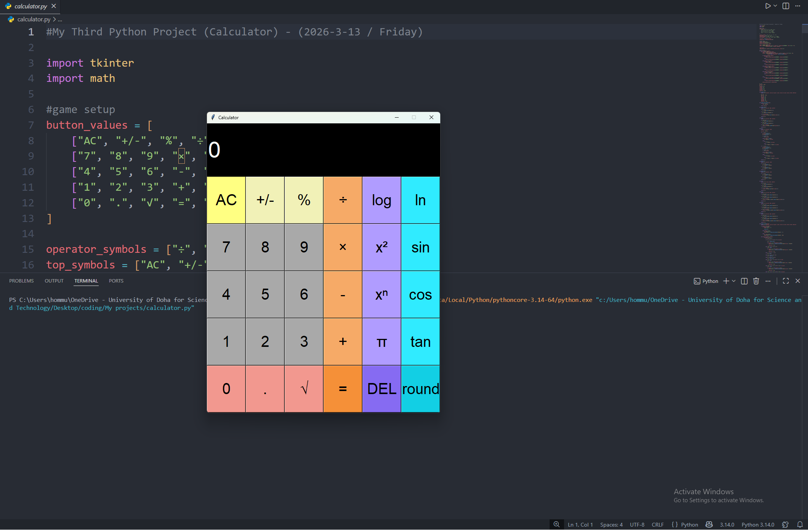

# Python Calculator

This project is a functional calculator built with Python.

It is designed to perform a variety of mathematical operations efficiently through an interactive interface.

## Features
- Basic arithmetic operations
- Advanced mathematical functions
- User-friendly interaction
- Error handling for invalid inputs

## Purpose
This project was created to strengthen my Python programming skills and improve my understanding of functions, logic building, and problem-solving techniques.

## Technologies Used
- Python

## How to Run
1. Open the terminal  
2. Navigate to the project folder: cd Calculator
3. Run the program : python main.py

## Screenshot

